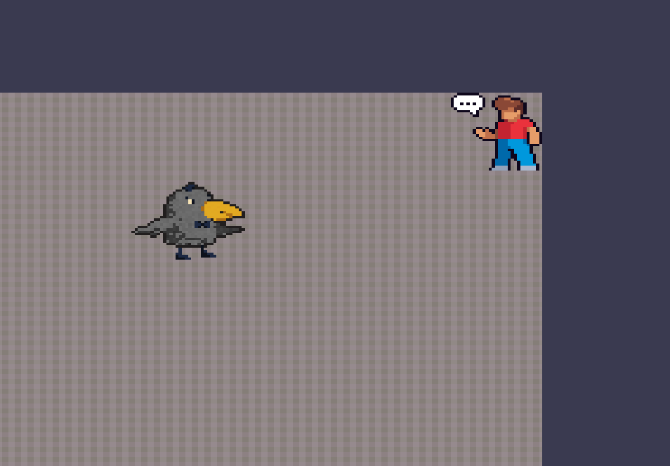

# HSE Rouglike
## О проекте
### Описание игрового процесса 
Данный проект представляет собой игру-симулятор жизни студента, сочетающий в себе элементы рогалика и квестов. В игре пользователь сталкивается с двумя основными типами заданий: поиск предметов и ответы на вопросы. Особенностью игры является то, что каждый раз при запуске создаётся новая карта, а так же многопользовательский режим и бонусный предмет - кофе, увеличивающий скорость игрока на некоторое время.

#### Управление:
 - **W, A, S, D** - перемещение 
 - **E** - взаимодействие с предметами и NPC
 - **Z** - уменьшить масштаб камеры



## Инструкция по установке
### Используемые библиотеки: 
 - SFML 2.5.1. 
 - nlohmann_json 3.2.0

Все библиотеки устанавливаются автоматичски через FetchContent
### Сборка 

    git clone https://github.com/itsahologram/hse-rougelike.git
    mkdir build

 - Windows
 ``` 
	cmake -S . -B build 
    cmake --build build --config Release
```


 - Linux or MacOS
```
	cmake -S . -B build -DCMAKE_BUILD_TYPE=Release
	cmake --build build
```

### Запуск
Находясь в директории ``build`` запустите проект 
```
./hse-rougelike
```
## Навигация по репозиторию:
-  [sfml-network](https://github.com/itsahologram/hse-rougelike/tree/sfml_network) - в данной ветке велась работа с сетью
- [sfml](https://github.com/itsahologram/hse-rougelike/tree/sfml) - работа с графикой и логикой игры
- [qt](https://github.com/itsahologram/hse-rougelike/tree/qt) - первый прототип на QT (перемещение простого объекта по экрану)
- [grpc](https://github.com/itsahologram/hse-rougelike/tree/grpc) - тестовая ветка, была повреждена в процессе 
